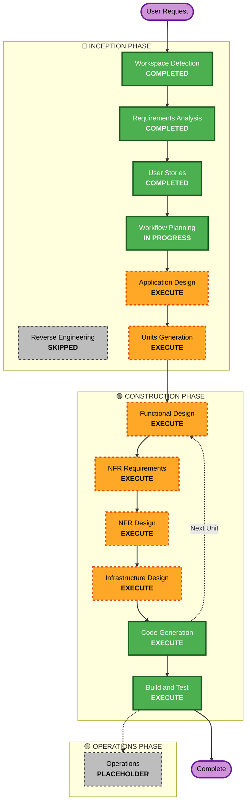

# Execution Plan for Auto-Trader (AT)

## Detailed Analysis Summary

### Change Impact Assessment
- **User-facing changes**: Yes — new system with Telegram interactions, HITL approvals, daily reports
- **Structural changes**: Yes — entirely new architecture (7+ components, 2 flows, 3 operating modes)
- **Data model changes**: Yes — new SQLite schema for portfolio state, audit trails, checkpoint logs, config history
- **API changes**: Yes — integrations with AlphaVantage, Kotak Neo API, BSE Bhavcopy, Telegram Bot API, OpenAlgo
- **NFR impact**: Yes — performance (8 GB VPS budget), security (credential encryption, VPS hardening), reliability (crash recovery, systemd watchdog), observability (per-module logging)

### Risk Assessment
- **Risk Level**: High — financial system handling real money (Phase 2), multiple external API dependencies, strict timing requirements (intraday checkpoints), complex state machine (3 operating modes with distinct guardrail configs)
- **Rollback Complexity**: Easy (Phase 1 is Sandbox/mock only — no real money at risk)
- **Testing Complexity**: Complex — requires unit tests for 13 guardrails, integration tests for 2 pipeline flows, backtesting framework

---

## Workflow Visualization



### Text Alternative
```
Phase 1: INCEPTION
  - Workspace Detection       (COMPLETED)
  - Reverse Engineering        (SKIPPED — Greenfield)
  - Requirements Analysis      (COMPLETED)
  - User Stories               (COMPLETED)
  - Workflow Planning          (IN PROGRESS)
  - Application Design         (EXECUTE)
  - Units Generation           (EXECUTE)

Phase 2: CONSTRUCTION (per-unit loop)
  - Functional Design          (EXECUTE, per-unit)
  - NFR Requirements           (EXECUTE, per-unit)
  - NFR Design                 (EXECUTE, per-unit)
  - Infrastructure Design      (EXECUTE, per-unit)
  - Code Generation            (EXECUTE, per-unit)
  - Build and Test             (EXECUTE, after all units)

Phase 3: OPERATIONS
  - Operations                 (PLACEHOLDER)
```

---

## Phases to Execute

### 🔵 INCEPTION PHASE
- [x] Workspace Detection — COMPLETED
- [x] Reverse Engineering — SKIPPED (Greenfield)
- [x] Requirements Analysis — COMPLETED (requirements.md synthesized from 638-line formal spec + 12 clarifications)
- [x] User Stories — COMPLETED (12 epics, 34 stories, 2 personas)
- [x] Workflow Planning — IN PROGRESS
- [ ] **Application Design — EXECUTE**
  - *Rationale*: Entirely new system with 7+ distinct components (data pipeline, feature engine, LightGBM model, Qlib MVO optimizer, risk engine, execution layer, scheduler); component boundaries, interfaces, service orchestration, and dependency graph all need explicit design before decomposition into units
- [ ] **Units Generation — EXECUTE**
  - *Rationale*: Complex multi-component system that benefits from structured decomposition into units of work; determines implementation sequence and dependency ordering for code generation

### 🟢 CONSTRUCTION PHASE (per-unit loop)
- [ ] **Functional Design — EXECUTE (per-unit)**
  - *Rationale*: Complex business logic per component — 13 guardrail rules, 3-tier checkpoint orchestration, trailing stop-loss ratcheting, drawdown tier logic with cooling-off/peak-reset, cold-start ramp, feature engineering formulas; all need detailed design before code
- [ ] **NFR Requirements — EXECUTE (per-unit)**
  - *Rationale*: Performance constraints (8 GB VPS memory budget, 10-min checkpoint timeout), security (encrypted credentials, log scrubbing, VPS hardening), observability (4 per-module log files), reliability (crash recovery, graceful shutdown, Telegram fallback)
- [ ] **NFR Design — EXECUTE (per-unit)**
  - *Rationale*: NFR patterns must be designed (SQLite schema, logging framework, credential encryption scheme, retry/backoff logic, systemd watchdog integration) before code generation
- [ ] **Infrastructure Design — EXECUTE (per-unit)**
  - *Rationale*: Hetzner VPS deployment architecture, systemd service definitions, cron schedule configuration, SQLite database schema, backup pipeline, UFW firewall rules, log rotation configuration all need specification
- [ ] **Code Generation — EXECUTE (per-unit, ALWAYS)**
  - *Rationale*: Implementation of all units
- [ ] **Build and Test — EXECUTE (ALWAYS)**
  - *Rationale*: Build instructions, test suite execution, integration validation

### 🟡 OPERATIONS PHASE
- [ ] Operations — PLACEHOLDER (future deployment and monitoring workflows)

---

## Depth Level Assessment

| Stage | Recommended Depth | Rationale |
|---|---|---|
| Application Design | **Standard** | Well-defined components in formal spec; design formalizes boundaries and interfaces |
| Units Generation | **Standard** | Component groupings are fairly clear from the architecture; main question is granularity |
| Functional Design | **Comprehensive** | Complex business rules (guardrails, checkpoints, exit logic, mode transitions) require detailed specification |
| NFR Requirements | **Standard** | NFRs are well-defined in formal spec; assessment confirms and organizes them |
| NFR Design | **Standard** | Design patterns are mostly conventional (SQLite, logging, encryption, retry) |
| Infrastructure Design | **Standard** | Single-VPS architecture is straightforward; systemd + cron + UFW are well-understood |
| Code Generation | **Comprehensive** | Production-quality financial system with strict correctness requirements |

---

## Success Criteria

- **Primary Goal**: Fully functional Phase 1 Sandbox system capable of autonomous paper trading on BSE
- **Key Deliverables**:
  - Complete data pipeline (AlphaVantage + Kotak Neo API + BSE Bhavcopy)
  - LightGBM training and inference pipeline via Qlib
  - Risk engine enforcing all 13 guardrails
  - OpenAlgo mock execution with full order lifecycle
  - Evening batch + Intraday checkpoint orchestration
  - Watchlist management with Saturday screener
  - Telegram bot integration (notifications, heartbeats, approval workflows)
  - Backtesting framework passing minimum viability gate
  - Per-module logging (data, model, execution, scheduler)
  - SQLite persistence for all state
  - systemd service management on Hetzner VPS
  - Comprehensive test suite (unit + integration)
- **Quality Gates**:
  - All guardrail unit tests pass with boundary conditions
  - Full evening batch integration test passes
  - Full checkpoint integration test passes
  - Backtest meets AI-recommended viability thresholds
  - System runs locally on Windows native before VPS deployment
